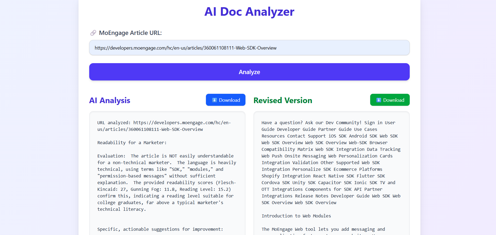
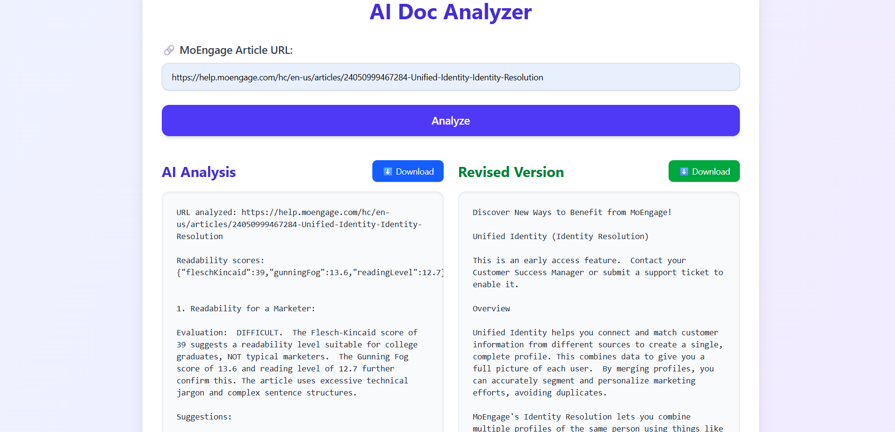

Snapshots: 

## 📄 Example Output

Below are two example outputs from Agent 1 (Google Gemini flash) for different MoEngage documentation URLs.

###  Example 1:  
**URL:** https://help.moengage.com/hc/en-us/articles/360058891172  
**Title:** Creating and Managing Segments

####  Suggestions from Gemini Pro:
- Refer analysis_report1.txt

### Revised Version
- Refer revised_content1.txt

###  Example 2:  
**URL:** https://help.moengage.com/hc/en-us/articles/4405894169497  
**Title:** MoEngage Email - Getting Started

####  Suggestions from Gemini Pro:
- Refer analysis_report2.txt

### Revised Version
- Refer revised_content2.txt
